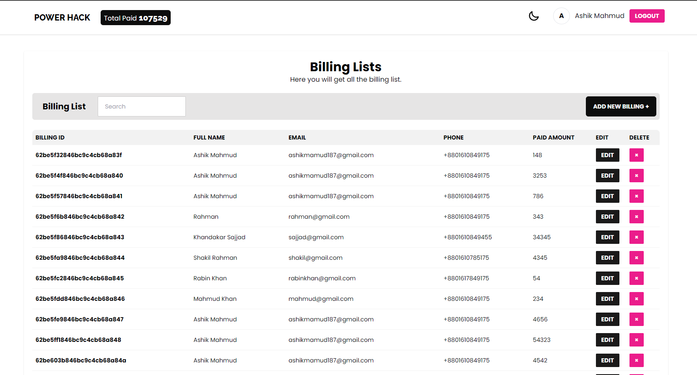

# Power Hack Application

This is Power hack Application using MERN Technologies

## Live Link <https://power-hack-client.netlify.app>

## Using Technologies

- REACT JS
- JAVASCRIPT
- TAILWIND CSS
- DAISY UI
- REACT ROUTER DOM
- REACT HOT TOAST
- AXIOS
- REACT QUERY

## Required Technologies

- Create Account with Email and Password
- Add Billing Details for the user
- And also can edit, delete with niche pagination's.

## Features

## Necessary Links

- [Client Link](https://github.com/Ashik-Mahmud/power-hack-client)
- [Client Live Link](https://power-hack-client.netlify.app/)
- [Server Link](https://github.com/Ashik-Mahmud/power-hack-server)
- [Server Live Link](https://power-hack-server.herokuapp.com/)

## Preview Screenshot

> Thanks for reach out me on GitHub.
